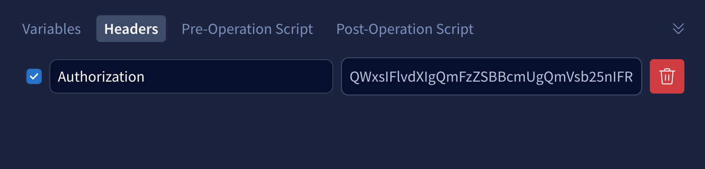

# organizational-challenge
A simple API for constructing and interacting with an organizational structure

## Implementation details

- [X] Setup [Apollo Server] (https://www.apollographql.com/docs/apollo-server) 
- [X] Implement a basic schema for the requirements of this solution
- [X] Implement basic resolving for querying as well as mutating data
- [X] Implement simple solution for handling authentication
- [X] Introduce resolving of height, based on position in hierarchy
- [X] Introduce handling of manager/developer role
- [ ] **Optional** - Implement simple integrationtests for ensuring feature completeness
- [ ] **Optional** - Setup service in a hosted enviroment


## Running the solution

The service is based on [Apollo Server] (https://www.apollographql.com/docs/apollo-server). 

To get it running, start by cloning the following repository:

`git clone git@github.com:jesperrasmussen/organizational-challenge.git`

And simply run `npm start`.

The project should start - and if everything went well, you should get this message: `🚀  Server ready at: http://localhost:4000/`


**Note:** As the project includes both `node_modules` and `dist` folders, it shouldn't be necessary to install any dependencies, but in case it fails, clearing out these folders, running `npm install` afterwards, should pull dependencies again. 

In that case, simply run `npm start` yet again after dependencies are installed.


## Using the API

When accessing `http://localhost:4000/`, you'll be in the GraphQL Playground/Sandbox. This allows you to query the API using GraphQL, as well as inspect the objects you're able to query for.

### Authentication

The API is simply using an API key for this purpose. The check is on the `Authorization` header and the key is `QWxsIFlvdXIgQmFzZSBBcmUgQmVsb25nIFRvIFVz`

The API will reject all introspection, meaning that you will not be able to see what queries, mutations and objects, the API supports, unless you provide the header.

In the Sandbox, headers are set just below the area for queries (Operation), as shown in the image below: 



### Sample usage


I've put together a few sample queries to demonstrate the API features:

Fetching a node based on id is shown here. Notice that due to the declarative nature of GraphQL, getting information on children of a given node is straight forward and can be applied in a recursive manner depending on the depth of the organization:

```
query fetchNode {
  node(id: 1) {
    name
    height
    children {
      id
      name
      height
      children {
        id
        name
        height
        children {
        	id
          name
          height
        }
      }
    }
  }
}
```

Adding a new node looks like this. Note that the API will return the created Node as response, meaning that we can query that just after creation. The ID is simply calculated as auto incrementing on existing IDs already in the system:

```
mutation addNode {
  addNode(node: {
    name: "Developer",
    parentId: 2,
    programmingLanguage: "Rust"
  }) {
    id
    name
  }
}
```

Changing the parent of a node looks like this. In this case, based on the sample data, we'll actually move one manager (Manager A) to fit below another manager (Manager B), in effect also moving all of Manager A's "children" - as well as recalculating the height, as you'll probably note if executing the `fetchNode` query above, after changing a parent in this manner:

```
mutation changeParent{
  changeParentNode(nodeId: 2, newParentId: 3) {
    id
    name
  }
}
```


## Technical decisions

As time is sparse, I'm skipping persistent storage for this simple implementation. 

The organizational nodes are stored using a simple object array in internal memory, and is reset to the sample data whenever the node service is restarted.

Given more time, it might be beneficial to look into document storage or a graph database for this particular system, given the access patterns mentioned.


## Reflections

There's definitely a lot of things to potentially do from here on out. 

Persistent storage would be an obvious first part to implement. Adding integration tests to check all edge-cases and ensure feature completeness would also make sense.

### Authentication

Adding authentication in the form of JWT or OAuth would make sense. The use of an API key was chosen purely out of time concerns, and would probably not fit the purpose for a public API, where security is of a higher concern. API keys would primarily make sense in a more obscure environment, where security exists in having to know where an API is running, as well as having the API key itself. 
 
One might argue that something role-based would be beneficial here, as checks for specific permissions might make sense, when building an organizational chart, that might not be fully editable by everyone internally. Also, fetching the organizational details might be public, while editing is not - this could be handled by an RBAC approach through another authentication mechanism.

### Developer / Manager

In terms of handling Manager/Developer roles, one might consider defining a common interface for the different roles, allowing for setting the role either on creation of the organizational node - or determining the role based on the position in the hierarchy, defining a developer as someone with no organizational "children".

Currently, both roles are handled by whatever input data is provided and as such, the API does not differentiate between the two, but it is instead up to the requester to determine which fields to fetch on the node, per the flexibility of GraphQL. Introducing an interface and two different types instead, would allow the GraphQL API to return the correct object type, exposing only the relevant attributes for a given role.